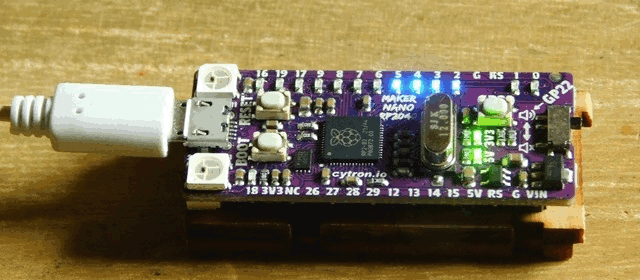
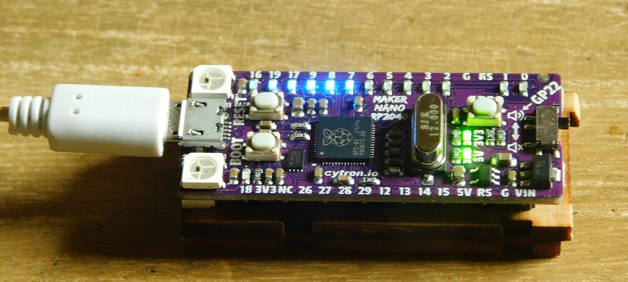

# Anamorphic Equalizer Afterglow
# ナイトライダーのあれ 残光バージョン



同じexamplesディレクトリ内にあるAnamorphic Equalizerに、LEDの動きに残光を加えてみました。
基本部分は、すべて同じです。

## 残光処理について

次のタスクにBlinkメッセージを送信した後に、発光量を下げながら、数回、発光する機能を追加しました。
これにより、LEDは残光により、尾を引くように流れていきます。  
興味のある方は、以下のソースコード内の __func (tn *TaskNode) run()__ をご覧ください。

ソースコード [main.go](./main.go)

	

サンプル動画
[Anamorphic Equalizer](./images/DSCN1137_854x480.mp4)

## 使用機材

[cytron](https://my.cytron.io/)社のマイコンボード __Maker Nano RP2040__ を使用しました。  
このボードには、最初から、LEDが直列に表面実装されており、簡単に実験ができました。  

* [Maker Nano RP2040](https://www.cytron.io/p-maker-nano-rp2040-simplifying-projects-with-raspberry-pi-rp2040)
     - [https://github.com/CytronTechnologies/MAKER-NANO-RP2040](https://github.com/CytronTechnologies/MAKER-NANO-RP2040)
     

## 移植について

### GPIO配列
使用するハードウェアに合わせてGPIOピンを定義する配列に、LEDの配置順にGPIOを書き込ん下さい。  

``` go
/* for Maker Nano RP2040 LED array 11 LEDs */
var pins = [...]machine.Pin{
	machine.GPIO2, machine.GPIO3, machine.GPIO4, machine.GPIO5,
	machine.GPIO6, machine.GPIO7, machine.GPIO8, machine.GPIO9,
	machine.GPIO17, machine.GPIO19, machine.GPIO16,
}
```

### LEDの初期状態

LEDの実装方法により、GPIO ピンの出力での点灯状態が異なってきます。

* High()の時に点灯する
* Low()の時に点灯する

全LEDの初期状態は、全て消灯状態にしておく必要があるので、LEDが消灯状態になるように、以下の定数を0か1を設定して下さい。

```go
const (
	InitialState int = 1
)
```

### 点滅パターン
点滅パターンは、以下の定数で設定しています。

``` go
const (
	LightOnTime time.Duration = 80 // 点灯時間(ms)
	DimmingRate time.Duration = 10 // 減光率
)
```
* 各ノードは、LightOnTimeで設定した時間で、1度だけ点滅します。
* また、減光率で、残光の明るさと時間を調整します。
