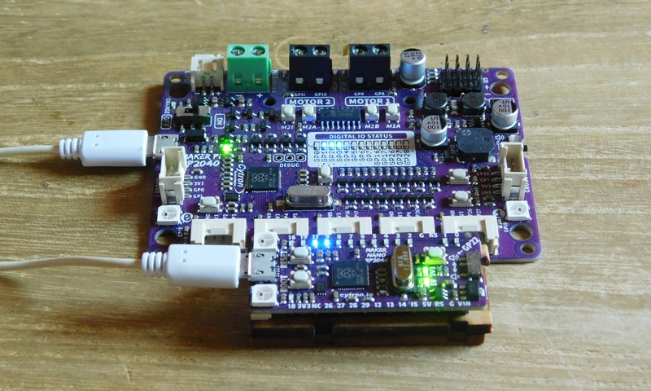
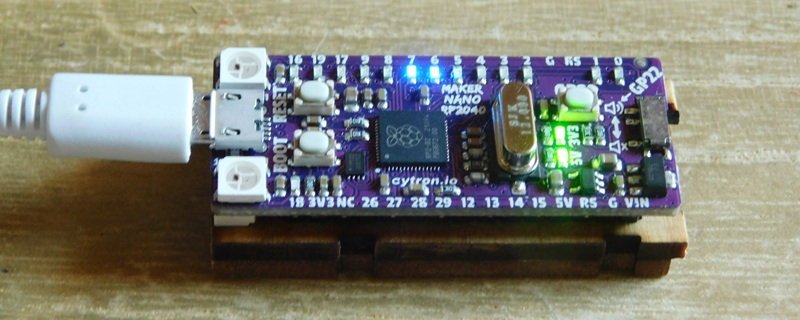
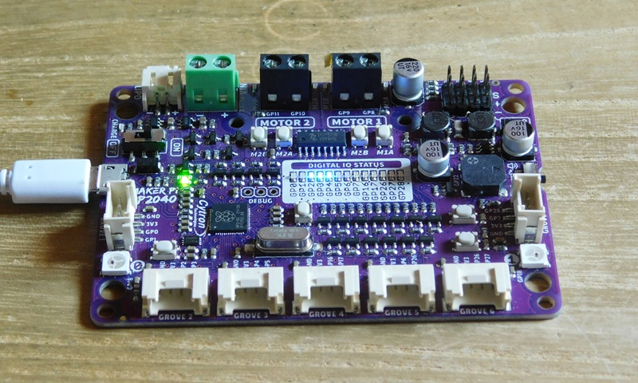

# Anamorphic Equalizer
# ナイトライダーのあれ

　アメリカで1982年から1986年に放送された特撮カーアクションドラマ、ナイトライダー（Knight Rider）の主人公マイケル・ナイトは、ナイト2000（正式名称：Knight Industries Two Thousand）、通称K.I.T.T.（キット）というスポーツカーに乗っていました。
　この車両のフロントバンパーの先端には左右に流れるように点灯する赤いランプが組み込まれており、これは、K.I.T.T.の「目」およびセンサーの役割を果たし、透視やハッキング、あらゆる物理データの分析を行うという設定になっていました。この装置の正式名称はフロント・スキャナー（アナモルフィック・イコライザー / Anamorphic Equalizer）だそうです。  
　古来より、電子工作界隈では、直列に配置した多連装LEDを左右に流れるように点灯させ、この「ナイトライダーのあれ」を再現する試みが行われてきました。
　今回、私も先人たちを見習い、「ナイトライダーのあれ」をtinygoで再現してみました。  



　最初は、単純にループを回して、順次LEDを点滅させていましたが、これでは、tinygoを使う意味がないと思いました。  
　そこで、ループで書かれたコードを見直し、以下のような構造にして、goroutineで再構築しました。  

* goroutineで1個1個のLEDをタスクとして制御し、それぞれをリンクリストで接続する。
* 1つのLEDにBlinkメッセージを送ると、点灯、消灯を行ってから、次のLEDにBlinkメッセージを送る。
* これを繰り返し、1列に並んだLEDが往復しながら、順次点滅していく。

サンプル動画
[Anamorphic Equalizer](./images/DSCN1096_854x480.mp4)

## 使用機材

今回は、[cytron](https://my.cytron.io/)社の以下のマイコンボードを使用しました。  
これらのボードには、最初から、LEDが直列に表面実装されており、簡単に実験ができました。  

* [Maker Nano RP2040](https://www.cytron.io/p-maker-nano-rp2040-simplifying-projects-with-raspberry-pi-rp2040)
     - [https://github.com/CytronTechnologies/MAKER-NANO-RP2040](https://github.com/CytronTechnologies/MAKER-NANO-RP2040)
     
* [Maker Pi RP2040](https://my.cytron.io/p-maker-pi-rp2040-simplifying-robotics-with-raspberry-pi-rp2040)
     - [https://github.com/CytronTechnologies/MAKER-PI-RP2040](https://github.com/CytronTechnologies/MAKER-PI-RP2040)
     


## 概要

本プログラムは、各LED（GPIOピン）を担当する独立した非同期タスク（`goroutine`）を、双方向リンクリストとして構築し、バケツリレー形式でメッセージ（シグナル）を伝播させることで「ナイトライダー（往復LED点滅）」を実装しています。  

**データ構造 (`TaskNode`):**
各タスクは以下の情報を持つ `TaskNode` 構造体として定義されます。  

* `Id`: ノードの識別番号。
* `Led`: 操作対象となるハードウェア（LEDデバイス）。
* `MyChan`: 他のノードからメッセージ（バトン）を受け取るためのGoチャネル。
* `Next`: 順方向（右側）に隣接する `TaskNode` へのポインタ。最後尾のノードは `nil` になります。
* `Prev`: 逆方向（左側）に隣接する `TaskNode` へのポインタ。最前列のノードは `nil` になります。

### LED双方向リンクリスト (Doubly Linked List)　の構造

各LEDを制御するタスク(`TaskNode`)がチェーン状に繋がっています。  
各ノードには「自分より前のノード」と「自分より後のノード」が設定されています。

```text
                   <-- Node0        <-- Node1        <-- Node2        <-- Node3
                        ↑               ↑               ↑               ↑
 [ Prev: nil   ]  [ Prev: Node0 ]  [ Prev: Node1 ]  [ Prev: Node2 ]  [ Prev: Node3 ]
 [ Id  : 0     ]  [ Id  : 1     ]  [ Id  : 2     ]  [ Id  :  3    ]  [ Id  : 4     ]
 [ Next: Node1 ]  [ Next: Node2 ]  [ Next: Node3 ]  [ Next: Node4 ]  [ Next: nil   ]
        ↓               ↓               ↓               ↓
      Node1 -->        Node2 -->        Node3 -->        Node4 -->

 <=== 折り返し(Direction: -1) =============================== 往路(Direction: 1) ===>
```
## 動作の仕組み

1. **構築:** `main` 関数内で、設定されたピンリストに基づき順次ノードを生成し、`Prev` と `Next` を繋ぎ合わせて一列の双方向リストを構築します。構築と同時に各ノードの待機ループ（`run()`）が裏側で起動します。
2. **実行:** `main` から最初のノードのチャネルに「順方向（1）」のメッセージが投げられると動作が開始します。
3. **伝播と反転:**
* メッセージを受け取ったノードは自身のLEDを点灯・消灯（Blink）させます。
* 現在の進行方向が「1（順方向）」の場合、`Next` を参照して次のノードにメッセージを送信します。
* もし `Next` が `nil`（右端の終点）だった場合、進行方向を「-1（逆方向）」に反転させ、`Prev` のノードへメッセージを送信します。
* 逆方向へ進むときも同様に、`Prev` が `nil`（左端の始点）になれば方向を「1」に反転させます。
4. **スケーラビリティ:** リストにノードを動的に挿入・削除するだけで、全体のループロジック（`run()`内）を変更することなく、LEDの数を柔軟に変更できるメリットがあります。

詳細については、以下のソースコードをご覧ください。

ソースコード [main.go](./main.go)

## 移植について

使用するハードウェアに合わせてGPIOピンを定義する配列に、LEDの配置順にGPIOを書き込ん下さい。  

``` go
/* for Maker Nano RP2040 LED array 11 LEDs */
var pins = [...]machine.Pin{
	machine.GPIO2, machine.GPIO3, machine.GPIO4, machine.GPIO5,
	machine.GPIO6, machine.GPIO7, machine.GPIO8, machine.GPIO9,
	machine.GPIO17, machine.GPIO19, machine.GPIO16,
}
```

必要に応じて、点滅パターンを修正して下さい。各ノードは、このタイミングで1度だけ点滅するので、実機での点滅状態を確認しながら調整して下さい。  

``` go
/* for Maker Nano RP2040 LED array 11 LEDs */
const (
	LightOnTime  time.Duration = 70 // 点灯時間
	LightOffTime time.Duration = 21 // 消灯時間
)
```
